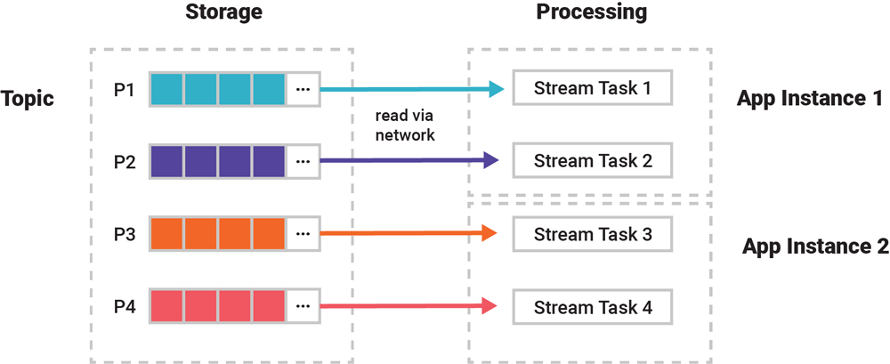

# 03 - Processing Fundamentals with Kafka Streams and ksqlDB

## Storing vs Processing


### Storing layer
The storing layer of Kafka regards how data is persisted in **topics** and **partitions**: 
events are stored as ordered sequences of unbounded (limitless) binary key, value pairs, distributed over 
multiple **partitions** (potentially replicated on multiple **brokers** to guarantee parallelism and 
redundancy).  

### Processing
The processing layer is about transforming persisted data in Kafka, offering them structured for client purposes.
The example is the RDBMS which transfers the db data in the filesystem into the tables where we can execute queries.
This is the layer regarding how data can be processed, mainly in **[Streams](https://docs.confluent.io/platform/current/streams/overview.html)** and **[Tables](https://ksqldb.io/)** 
using the _Kafka Stream API_ (we are not considering the vanilla _Kafka publisher/consumer API_ as an alternative processing layer).

## KStreams
Kafka stream processing allow the creation of streams of **typed events** (for both key and value), where **serdes** are used (element to serialize and deserialize binary event data and keys).
They are usually also unbounded as the underlying topic is.

```java
// Create KStream from Kafka topic.
StreamsBuilder builder = new StreamsBuilder();
KStream<UUID, String> stream =
  builder.stream("input-topic", Consumed.with(Serdes.UUID(), Serdes.String()));
```

## KTable

**Tables** are, as said, _aggregation of streamed events_, representing a cumulative status of data.
As example, we have the stream of moves of a chess game, and the table represented as the chess board.
A table in Kafka is today more like an **RDBMS materialized view** than an RDBMS table, 
because it relies on a change being made elsewhere rather than being directly updatable itself.
At any time, the table aggregates all the events in the underlying stream to represent its current status.
Even though, theoretically a table is always based on a stream, it is also possible, for convenience, to create a table
from a topic directly.

Normally, tables are **bounded**, meaning that they represent bounded set of data (a company has a limited number of customers, a limited number of products to sell, and so on). For instance, 
if we want a table of all visited locations, per person out of a travel event stream, we have a bounded number of person key in the table; 
but, nevertheless, we can keep adding new person's keys to the table. 

### Create table from a topic

**KsqlDb**
```sql
-- Create ksqlDB table from Kafka topic.
CREATE TABLE myTable (username VARCHAR, location VARCHAR)
  WITH (KAFKA_TOPIC='input-topic', KEY='username', VALUE_FORMAT='...');
```

**Java**
```java
// Create KTable from Kafka topic.
KTable<String, String> table = builder.table("input-topic", Consumed.with(Serdes.String(), Serdes.String()));
```

### Create a table from a stream

First we define a stream from a topic (also not pre-existing)

```sql
CREATE STREAM riderLocations (profileId VARCHAR, latitude DOUBLE, longitude DOUBLE)
  WITH (kafka_topic='locations', value_format='json', partitions=1);
```
Where:
* _kafka_topic_:  Name of the Kafka topic underlying the stream. In this case it will be automatically created because it doesn't exist yet, but streams may also be created over topics that already exist.
* _value_format_: Encoding of the messages stored in the Kafka topic. For JSON encoding, each row will be stored as a JSON object whose keys/values are column names/values. For example: {"profileId": "c2309eec", "latitude": 37.7877, "longitude": -122.4205}
* _partitions_: Number of partitions to create for the locations topic. Note that this parameter is not needed for topics that already exist.

Then we create the table

```sql
CREATE TABLE currentLocation AS
  SELECT profileId,
         LATEST_BY_OFFSET(latitude) AS la,
         LATEST_BY_OFFSET(longitude) AS lo
  FROM riderlocations
  GROUP BY profileId
  EMIT CHANGES;
```
or 
```sql
CREATE TABLE ridersNearMountainView AS
  SELECT ROUND(GEO_DISTANCE(la, lo, 37.4133, -122.1162), -1) AS distanceInMiles,
         COLLECT_LIST(profileId) AS riders,
         COUNT(*) AS count
  FROM currentLocation
  GROUP BY ROUND(GEO_DISTANCE(la, lo, 37.4133, -122.1162), -1);
```
This list will output the list of drivers all grouped by their distance from a location (Mountain view)

Now we can create a **push query**

```sql
-- Mountain View lat, long: 37.4133, -122.1162
SELECT * FROM riderLocations
WHERE GEO_DISTANCE(latitude, longitude, 37.4133, -122.1162) <= 5 EMIT CHANGES;
```

This query on the table will start emitting rows as a stream, satisfying the given condition (within 5 miles from Mountain view)
If we inseer the follwing rows to the table (data will be added to the underlying topic), 

```sql
INSERT INTO riderLocations (profileId, latitude, longitude) VALUES ('c2309eec', 37.7877, -122.4205);
INSERT INTO riderLocations (profileId, latitude, longitude) VALUES ('18f4ea86', 37.3903, -122.0643);
INSERT INTO riderLocations (profileId, latitude, longitude) VALUES ('4ab5cbad', 37.3952, -122.0813);
INSERT INTO riderLocations (profileId, latitude, longitude) VALUES ('8b6eae59', 37.3944, -122.0813);
INSERT INTO riderLocations (profileId, latitude, longitude) VALUES ('4a7c7b41', 37.4049, -122.0822);
INSERT INTO riderLocations (profileId, latitude, longitude) VALUES ('4ddad000', 37.7857, -122.4011);
```
The push query will output matching rows in real time as soon as they're written to the `riderLocations` stream.

We can also run a **pull query**

```sql
SELECT * from ridersNearMountainView WHERE distanceInMiles <= 10;
```

In contrast to the previous push query which runs continuously, the pull query follows a traditional request-response model retrieving the latest result from the materialized view.

## Partitioned processing

As mentioned for the storage layer, topics are partitioned and each consumer read events from a specific partition of the topic.
Data in a topic is processed per partition, which in turn applies to the processing of streams and tables, too. 
To understand this, we must first talk about the concept of consumer groups in Kafka.


### Consumer groups
To process the data collaboratively, multiple instances of one application can dynamically form a so-called _Kafka consumer group_, at runtime, that reads from the same input topic(s). 
This group membership is configured with the `application.id` setting for Kafka Streams apps, the `ksql.service.id` setting for ksqlDB servers in a ksqlDB cluster, and the `group.id` setting for applications that use one of the lower-level Kafka consumer clients in your favorite programming language, 
as well as for worker nodes in a Kafka Connect cluster.

## Group processing - The [Kafka's consumer group protocol](https://kafka.apache.org/protocol)


For example, we could write a distributed, multi-instance fraud detection application with Kafka Streams to process the events in a high-volume payments topic in parallel, 
and its app instances would all be members of the same group `fraud-detection-app` that represents the logical application. 
This application would then be deployed next to a Kafka cluster, from which it would read and write events via the network.

Here we have two instances of the application within the same consumer group: as said before, **each partition will be assigned, for reading, to one consumer only** 
(if the number of replicas is greater than the number of partitions, we will have idle consumers), but _one consumer can have assigned more then one topic's partition_ (that's determined by the protocol).

The group automatically detects whenever new instances join or existing instances leave the group (e.g., because Kubernetes killed a container), 
and then it automatically redistributes the workload and partition assignments so that data processing continues automatically.

This coordination process is called [rebalancing](https://docs.confluent.io/current/clients/consumer.html#concepts) in Kafka, 
and it is a part of the consumer group protocol. 
For example, rebalancing is triggered when _a new ksqlDB server node joins a ksqlDB cluster_, or when _an instance of a Kafka Streams application is terminated_. 
All this happens during live operations of your applications, without the risk of data loss or incorrect data processing. 
If you want to learn about rebalancing in more detail, I recommend the article [Apache Kafka Rebalance Protocol, or the Magic Behind Your Streams Applications](https://medium.com/streamthoughts/apache-kafka-rebalance-protocol-or-the-magic-behind-your-streams-applications-e94baf68e4f2), who is a Confluent Community Catalyst.


### Stream tasks



The actual **unit of parallelism**, is not the application instance but the **stream task**  (which processes both streams and tables, despite its name). 
An application instance can be running zero, one, or multiple such tasks during its lifecycle. 
_Input partitions from topics/streams/tables are assigned 1:1 to stream tasks for processing_ (that's how one application instance can process more partitions at the same time). 

Then, with the help of **Kafka’s consumer group protocol**, it is actually these stream tasks that are being distributed across an application’s instances whenever one instance joins or leaves the group, i.e., whenever a rebalancing process is being carried out.

For example, if our previous application processes an input topic with four partitions P1–P4, then this results in four stream tasks 1–4 for their respective processing. And these four tasks will then be evenly distributed across an application’s running instances. 
So if there are two app instances, then each will run two tasks for a total of four.

This is also why the “same event key to same partition” principle is so important: otherwise partitions can’t be processed together and, even more important in many use cases, processed in the correct order (considering that one stram task is always linked to the same partition)

Processing is carried out by stream tasks. Every task is responsible for processing one particular input partition, which means there are exactly as many stream tasks as there are input partitions neither more nor less. 
These stream tasks are evenly assigned by Kafka to the running instances of your application to allow for scalable, parallel processing of your data.


https://developer.confluent.io/courses/kafka-streams/get-started/


